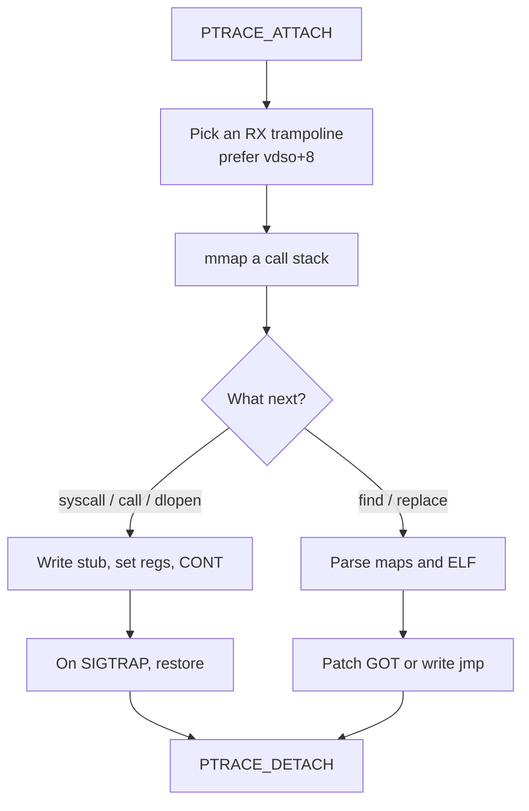
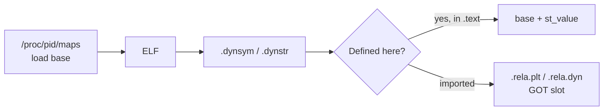
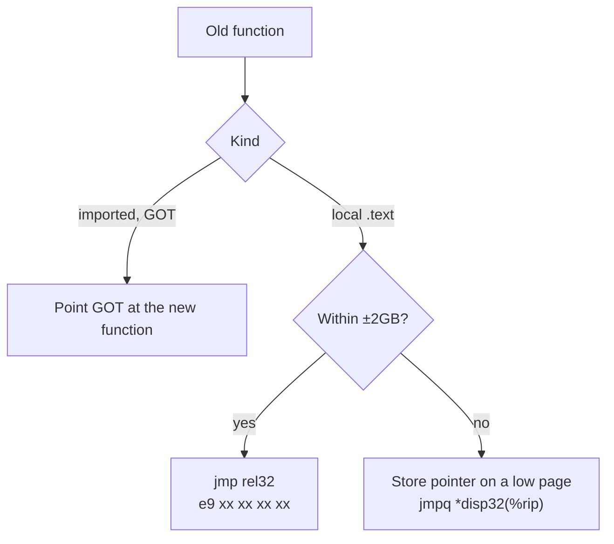

# hookso

[](https://github.com/esrrhs/hookso)
[](https://github.com/esrrhs/hookso)
[](https://github.com/esrrhs/hookso/actions)

hookso uses `ptrace` to take over another process and, in that process's address space, run syscalls, load or unload `.so` files, look up symbols, and replace functions. It targets **x86-64 Linux**. The implementation lives in a single `main.cpp` so the control flow is easy to follow.

[中文](./README_ZH.md) · [Usage details](./README_USAGE.md)

## What it can do

- Run a syscall in the target, or call a function in an already-loaded `.so`
- `dlopen` / `dlclose` to attach or unload a library
- Find a function address and read arguments of the next call
- Replace an old function (or an arbitrary address) with a function from a new `.so`, and restore it later
- When a target function is **about to run**, fire a syscall / call / dlopen / …

## How it works

hookso does not start a helper thread inside the target. It stops the process, writes a few instructions into memory that is already executable, points RIP at that stub, lets the target run the work itself, then restores the original bytes and registers.



### 1. Attach

`PTRACE_ATTACH` then `waitpid` leaves the target stopped at an instruction boundary. Memory and register access happen in that state. If setup fails after attach, hookso `DETACH`s so the target is not left in SIGSTOP.

### 2. Trampoline: 8 bytes of code in the target

To make the **target** execute `mmap`, `dlopen`, or an arbitrary function, hookso needs executable memory in that process for a short stub.

| Purpose | Bytes | Meaning |
|---------|--------|---------|
| Remote syscall | `0f 05 cc` | `syscall; int3` |
| Remote call | `ff d0 cc` | `callq *%rax; int3` |

`int3` returns control to hookso (`SIGTRAP`). The original 8 bytes and registers are then restored.

Trampoline location, in order:

1. **`[vdso] + 8`**: vdso is a small ELF the kernel maps, almost always `r-xp`. Offset 8 is `e_ident[8..15]`, normally padding.
2. An **executable** libc mapping that includes the ELF header, plus 8 (older distros often map the whole first segment `r-xp`).
3. Start of libc `.text` (overwrites real instructions; last resort).

```text
e_ident:
  +0  7f E L F
  +4  class / data / version / osabi
  +8  padding      ← stub goes here
```

`libc_base + 8` is not always valid. Current glibc maps the ELF header as **`r--p`**. Executing there SIGSEGVs, which is why vdso is preferred.

Remote syscalls use the Linux convention: `rax` = number, `rdi rsi rdx r10 r8 r9` = args. Remote calls use SysV: `rdi rsi rdx rcx r8 r9`, plus an `mmap`'d stack with 16-byte-aligned `rsp`. String arguments are copied into a page allocated in the target, then passed as a pointer.

### 3. Reading and writing memory

Tried in order:

1. `process_vm_readv` / `process_vm_writev`
2. `pread` / `pwrite` on `/proc/<pid>/mem`
3. `PTRACE_PEEKTEXT` / `POKETEXT`

Ptrace poke can write RX pages, so the vdso / `.text` stub can be installed. Short reads or writes are treated as failure.

### 4. Finding a function in a `.so`



- A basename such as `libtest.so` is parsed from **target memory**. If section headers are not mapped, that fails with I/O error.
- A **filesystem path** parses the file, then adds the load base from maps. Use this for large libraries such as `libstdc++`.
- libc may appear as `libc-2.17.so` or `libc.so.6`. Injection tries `__libc_dlopen_mode` first, then public `dlopen` (the private symbol is gone in glibc 2.34+).

Internal vs imported symbols later pick different patch strategies.

### 5. Replace: GOT, near jump, far jump

hookso `dlopen`s the new `.so`, then patches the old site:



- **PLT/GOT**: only that `.so`'s imports change. `puts` inside `libtest.so` becomes `putsnew`; other modules keep the original `puts`.
- **Near jump**: `jmp rel32` is a signed 32-bit displacement (±2GB), not 4GB.
- **Far jump**: a non-PIE binary at `0x40...` cannot `rel32` to a `.so` at `0x7f...`. hookso allocates a page in the low 32-bit range, stores the new pointer, and writes `ff 25 disp32` (`jmpq *offset(%rip)`).

`setfunc` / `setfuncp` write the saved 8 bytes or GOT value back.

### 6. Catching one call: `arg` / `trigger`

An `int3` is written at the entry, then `CONT` waits for the next hit:

- RIP is decremented by 1 and the original bytes are restored
- Arguments are read as `rdi, rsi, rdx, rcx, r8, r9` (the 4th is `rcx`, not syscall `r10`)
- `trigger` can pass them on with `@1` meaning “first argument of the call just caught”

If the target is executing the bytes being patched, the patch is refused so those instructions are not torn.

## Quick start

```bash
./build.sh
cd test && ./build.sh && ./test &
PID=$!

../hookso find $PID ./libtest.so libtest
../hookso syscall $PID 1 i=1 s="haha" i=4
```

Full command list and walkthrough: **[Usage](./README_USAGE.md)**.

```bash
./hookso syscall  <pid> <nr> i=1 s="str"
./hookso call     <pid> so func i=1
./hookso dlopen   <pid> ./new.so
./hookso replace  <pid> old.so old new.so new
./hookso arg      <pid> so func 1
```

Tests: `bash test/run_tests.sh` (needs ptrace; CI sets `yama.ptrace_scope=0`).

## Limits

- x86-64 only; syscall / call / dlcall take at most 6 integer or string arguments
- `replace` requires matching signatures or the target will crash
- Only the given pid's thread is attached; other threads can still race a patch
- If a `.so` is not fully mapped, pass a **file path** instead of the soname

## Who is using it

[cLua](https://github.com/esrrhs/cLua) · [pLua](https://github.com/esrrhs/pLua) · [dLua](https://github.com/esrrhs/dlua) · [wLua](https://github.com/esrrhs/wLua)
