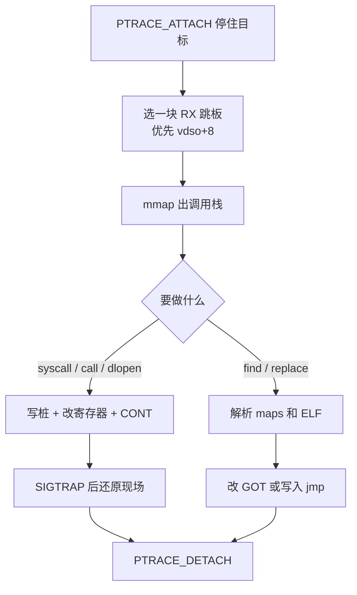
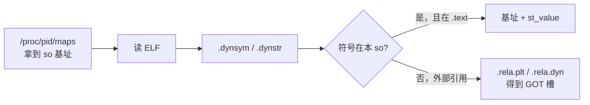
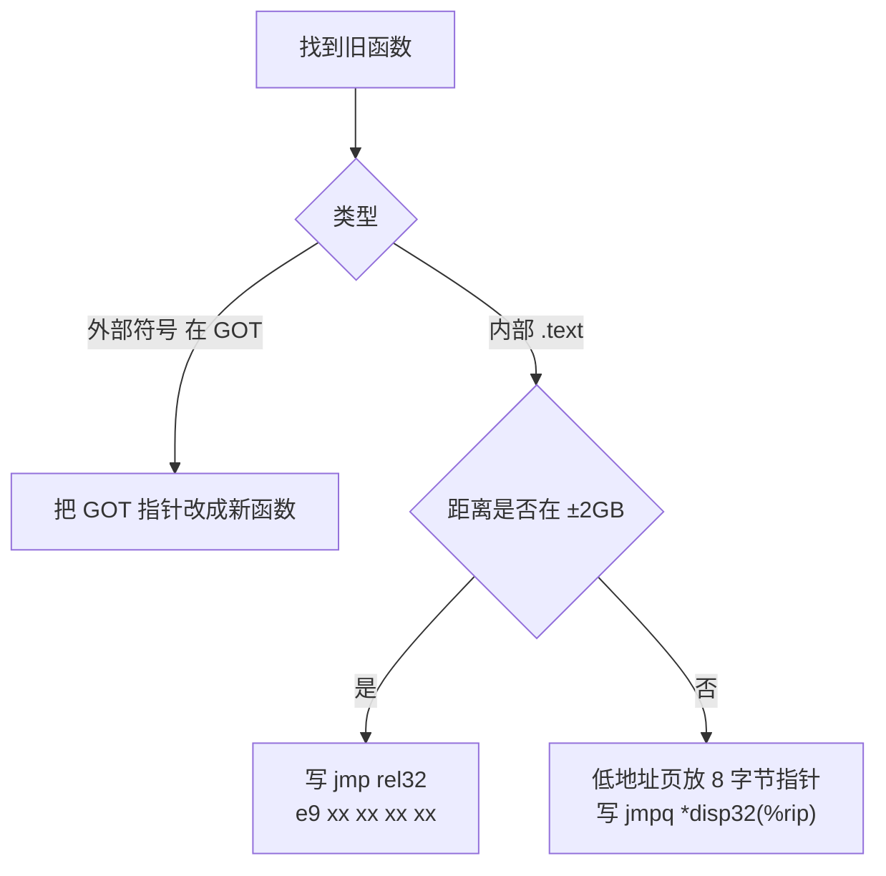

# hookso

[](https://github.com/esrrhs/hookso)
[](https://github.com/esrrhs/hookso)
[](https://github.com/esrrhs/hookso/actions)

hookso 用 `ptrace` 接管另一个进程，在它的地址空间里做系统调用、加载/卸载 `.so`、查找符号，以及把函数替换成新实现。核心是 **x86-64 Linux**，实现集中在一个 `main.cpp` 里，方便顺着代码读。

[English](./README.md) · [详细用法](./README_USAGE_ZH.md)

## 能做什么

- 让目标进程执行 syscall，或调用已加载 `.so` 里的函数
- `dlopen` / `dlclose` 挂接、卸载动态库
- 查找函数地址，读取某次调用的参数
- 把旧函数（或任意地址）替换成新 `.so` 里的函数，并可以还原
- 在目标函数**下一次被调用时**触发 syscall / call / dlopen 等动作

## 实现原理

hookso 不把代码注入成独立线程，而是：先把目标停住，再在它已有的可执行内存里临时写几条指令，改 RIP 让它“自己跑完”我们要的事情，然后把现场恢复回去。



### 1. 接管目标进程

`PTRACE_ATTACH` 之后 `waitpid`，目标停在某个指令边界上。后续读写内存、改寄存器、单步/继续，都按这个 stopped 状态来。失败时会 `DETACH`，避免把目标留在 SIGSTOP 里。

### 2. 跳板：在目标里执行 8 字节指令

要让**目标进程自己**执行 `mmap`、`dlopen` 或任意函数，必须在它的地址空间里找到一块 **可执行** 内存，临时写成桩代码。

桩只有两种：

| 用途 | 机器码 | 含义 |
|------|--------|------|
| 远程 syscall | `0f 05 cc` | `syscall; int3` |
| 远程函数调用 | `ff d0 cc` | `callq *%rax; int3` |

`int3` 用来把控制权交回 hookso（`waitpid` 收到 `SIGTRAP`）。跑完后把原来的 8 字节写回去，寄存器也恢复成 attach 时的值。

跳板位置按优先级：

1. **`[vdso] + 8`**：vdso 是内核映射的一小块 ELF，几乎总是 `r-xp`。`+8` 落在 `e_ident[8..15]`，一般是填充字节，改掉再还原不影响真正的 vdso 函数。
2. libc 里 **可执行** 且覆盖 ELF 头的映射 `+ 8`（老发行版常见：整段 `r-xp`）。
3. libc 的 `.text` 起始处（会覆盖真实指令，依赖备份/还原；仅当前面都没有时才用）。

```text
e_ident:
  +0  7f E L F     魔数
  +4  class / data / version / osabi
  +8  padding      ← 跳板写在这里
```

不能再用“libc 映射起点 + 8”一刀切。新 glibc 把 ELF 头放在 **`r--p`** 段，那里不可执行，RIP 指过去就是 SIGSEGV。这也是为什么优先用 vdso。

远程 syscall 按 Linux 约定传参：`rax` 系统调用号，`rdi rsi rdx r10 r8 r9`。远程 `call` 按 SysV ABI：`rdi rsi rdx rcx r8 r9`，并在目标里 `mmap` 一块栈，保证 `rsp` 16 字节对齐。

字符串参数会先在目标里 `mmap` 一页，把内容写进去，再把指针当作参数。

### 3. 读写目标内存

按这个顺序试，谁成功用谁：

1. `process_vm_readv` / `process_vm_writev`
2. `/proc/<pid>/mem` 的 `pread` / `pwrite`
3. `PTRACE_PEEKTEXT` / `POKETEXT`（按 `long` 拼）

ptrace poke 可以改 RX 页，所以跳板即使在 vdso / `.text` 上也能写。短读写会当成失败，避免静默截断。

### 4. 怎么找到某个 `.so` 里的函数



- 只传 `libtest.so` 这类名字时，从**目标内存**里读 ELF。节头如果没被 mmap 进来，会 I/O 错误。
- 传 **so 的文件路径** 时，从文件解析符号，再用 maps 里的基址加上偏移。大 so（例如 `libstdc++`）应走这条路径。
- libc 在 maps 里可能是 `libc-2.17.so` 或 `libc.so.6`；注入时优先 `__libc_dlopen_mode`，没有再用公开的 `dlopen`（glibc 2.34+ 已去掉前者）。

内部函数和外部函数后面替换方式不一样，所以这里会区分“`.text` 里的实现”还是“GOT 里的指针”。

### 5. 替换：GOT、近跳、远跳

先 `dlopen` 新 so，再按旧函数落点选择补丁：



- **PLT/GOT**：只改本 so 的导入表。`libtest.so` 里的 `puts` 会变成 `putsnew`，进程里其它模块的 `puts` 不动。
- **近跳**：`jmp rel32` 范围是有符号 32 位，约 ±2GB，不是 4GB。
- **远跳**：新 so 往往在 `0x7f...`，可执行文件若是 non-PIE 则在 `0x40...`，相对偏移放不进 `rel32`。这时在低 32 位地址申请一页，存新函数指针，原处写成 `ff 25 disp32`（`jmpq *offset(%rip)`）。

`setfunc` / `setfuncp` 把当时备份的 8 字节或 GOT 旧值写回去，用来还原。

### 6. 拦一次调用：`arg` / `trigger`

在函数入口写 `int3`，`CONT` 等到下一次命中：

- RIP 退回 1 字节，把入口还原
- 从寄存器读参数：`rdi, rsi, rdx, rcx, r8, r9`（第 4 个是 `rcx`，不是 syscall 的 `r10`）
- `trigger` 可以再用这些参数（`@1` 表示“刚才那个函数的第 1 个参数”）去跑 syscall / call / dlcall 等

如果目标正好跑在被改的那几条指令上，会拒绝补丁并提示重试，避免把正在执行的指令改碎。

## 快速开始

```bash
./build.sh
cd test && ./build.sh && ./test &
PID=$!

# 查地址
../hookso find $PID ./libtest.so libtest

# 让目标自己 write(1, "haha", 4)
../hookso syscall $PID 1 i=1 s="haha" i=4
```

命令一览、逐步示例、参数约定见 **[用法说明](./README_USAGE_ZH.md)**。

```bash
./hookso syscall  <pid> <nr> i=1 s="str"     # 远程 syscall
./hookso call     <pid> so func i=1          # 调已加载的函数
./hookso dlopen   <pid> ./new.so             # 注入
./hookso replace  <pid> old.so old new.so new
./hookso arg      <pid> so func 1            # 读下一次调用的第 1 个参数
```

集成测试：`bash test/run_tests.sh`（需要能 ptrace 子进程；CI 里会关掉 `yama.ptrace_scope`）。

## 限制

- 只支持 x86-64，syscall / call / dlcall 最多 6 个整数或字符串参数
- `replace` 要求新旧函数签名一致，否则目标会崩
- 默认只 attach 到给定 pid 对应的那个线程；多线程目标改代码仍有窗口
- so 没完整映射进内存时，把参数换成 **文件路径** 再查符号

## 应用

[cLua](https://github.com/esrrhs/cLua) · [pLua](https://github.com/esrrhs/pLua) · [dLua](https://github.com/esrrhs/dlua) · [wLua](https://github.com/esrrhs/wLua)
